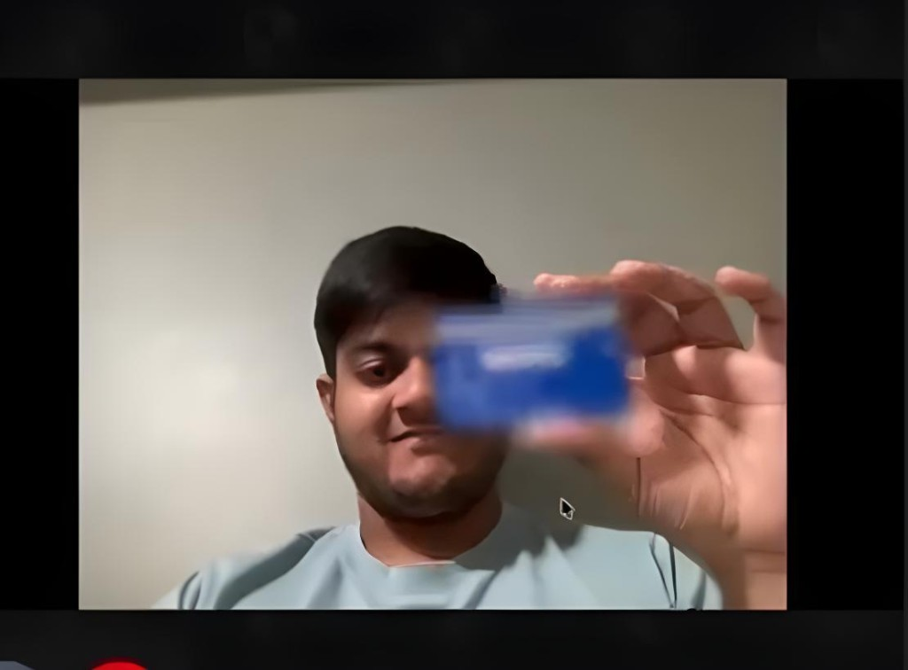
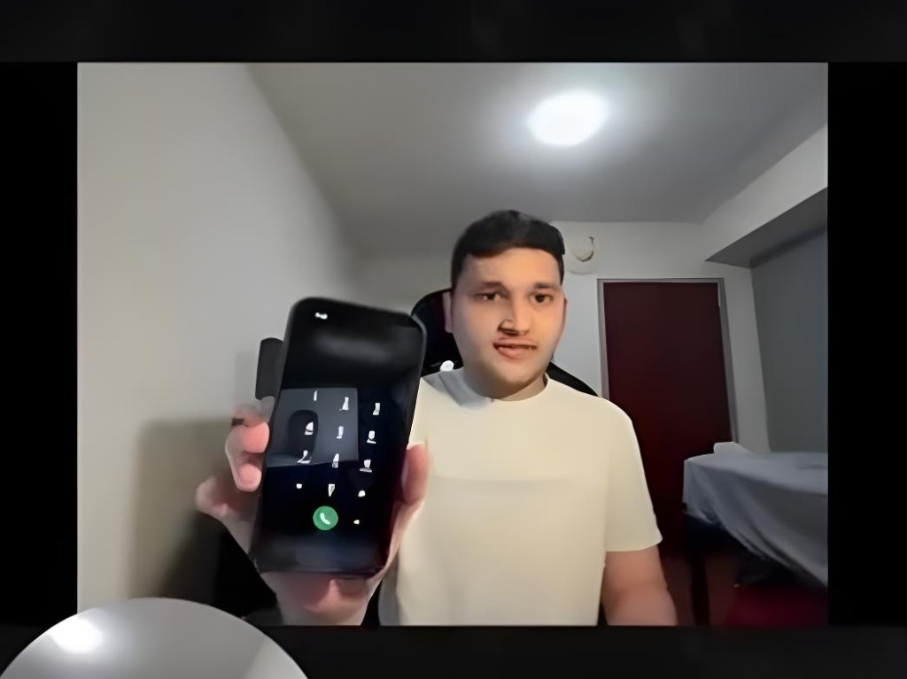
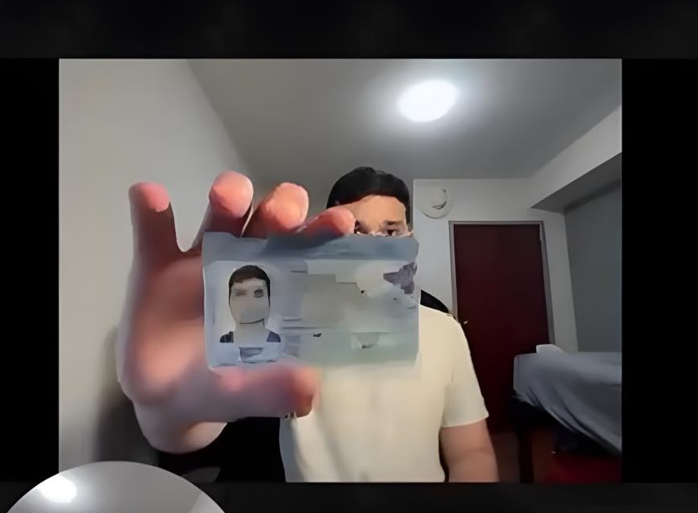

# Blurr: Real-Time Privacy for the Creator Economy


_Blurr is a prototype that blurs sensitive content out of a live camera feed before it reaches the other side of a video call._

## 🚀 Inspiration

In the creator economy, a single mistake can be catastrophic. Streamers, educators, and professionals live in constant fear of accidentally revealing a password, an API key, a phone number, or a private document during a live broadcast. A split-second error can lead to doxxing, financial loss, and a breach of trust with their audience. Existing solutions are manual and reactive—requiring streamers to use clumsy overlays or simply "be more careful." We knew there had to be a better way: a proactive, intelligent safety net that protects creators without them even thinking about it.

## 💡 What it does

**Blurr** is a working prototype of that safety net, built as a 1:1 browser video call. Your camera feed goes to a Python server that finds sensitive-looking regions in each frame and blurs them. Only the blurred video is sent on to the other person in the call, and the same blurred video is what you see in your own preview, so what you see is what they get.

What gets blurred:

* **Text-like regions:** lines of text picked out by an OpenCV pipeline, such as the digits on a card or the numbers on a phone screen.
* **Card- and ID-shaped objects:** any object the YOLOv8 detector finds whose bounding box has the proportions of an ID or credit card.
* **Books and documents:** anything YOLOv8 classifies as a `book`.
* **Other people:** everyone in frame except the largest person, who is assumed to be you.

All detection and blurring happens on the backend server, so the browser does no ML work. In this repo the server runs on your own machine (`http://localhost:8000`); the URL is configurable.

Blurr does not yet read the text it finds, integrate with streaming platforms, or process audio. See [Current limitations](#-current-limitations) for the full list.

### Example

Screenshots from the app with a credit card, a phone screen and an ID document held up to the camera.

| Credit card blurred | Phone screen blurred | ID document blurred |
| --- | --- | --- |
|  |  |  |

## 🛠️ How we built it

```
+----------------+   raw camera video    +------------------------------+
|  Your browser  | --------------------> |  Blur backend                |
|  (React app)   | <-------------------- |  FastAPI + aiortc            |
+-------+--------+     blurred video     |  OpenCV text + YOLOv8 object |
        |                                |  detection, Gaussian blur    |
        |                                +------------------------------+
        |  blurred video + mic audio
        |  (WebRTC, peer-to-peer)
        v
+----------------+
|  Other caller  |   Offers, answers and ICE candidates are exchanged
+----------------+   through Firebase Firestore.
```

* **Backend (`backend/`):** A **Python** server built with **FastAPI** and **aiortc**. `POST /offer` accepts a WebRTC offer, and every incoming video track is answered with a processed track that carries the blurred frames back over the same connection.
* **Text detection:** An **OpenCV** pipeline (morphological gradient, Otsu threshold, horizontal closing, then contour filtering by size and aspect ratio) finds regions shaped like lines of text. A PaddleOCR-based detector can be switched on instead.
* **Object detection:** **YOLOv8n**, the COCO-pretrained nano model (`backend/yolov8n.pt`), with a 0.5 confidence threshold. It is loaded once and shared by all connections.
* **Blurring:** Detected boxes are padded by a few pixels and covered with a 41×41 Gaussian blur. Everything outside the boxes is left untouched.
* **Frontend (`frontend/`):** **React 19**, **TypeScript** and **Vite**, styled with Tailwind CSS and shadcn/ui. It handles creating and joining calls by ID, mute, camera off, screen share and hang up.
* **Call transport:** The two browsers talk peer-to-peer over **WebRTC** using Google's public STUN servers. **Firebase Firestore** is the signaling channel: each call is a `calls/{id}` document holding the offer and answer, with `offerCandidates` and `answerCandidates` subcollections.
* **Audio** goes straight from your microphone to the other caller and never touches the backend.

## 🏁 Getting started

You need Python 3.10+ (tested on 3.13), Node.js 20.19+ or 22.12+, and a webcam.

**1. Start the backend**

```bash
cd backend
python3 -m venv .venv
source .venv/bin/activate
pip install -r requirements.txt
uvicorn main:app --port 8000
```

The first install is large because `ultralytics` pulls in PyTorch. The first call takes a few extra seconds while the YOLO model loads.

**2. Start the frontend**

```bash
cd frontend
npm install
npm run dev
```

Open http://localhost:5173.

**3. Make a call**

Click **Create a New Call**, allow camera and microphone access, and copy the call ID. Open the app in a second tab, paste the ID and click **Join Call**. To call between two machines, run the frontend and backend on each one and share the call ID.

### Configuration

| Setting | Where | Default | What it does |
| --- | --- | --- | --- |
| `VITE_BACKEND_URL` | `frontend/.env` (see `.env.example`) | `http://localhost:8000` | Where the frontend sends your camera video for blurring |
| `TEXT_DETECTION_METHOD` | top of `backend/main.py` | `"opencv"` | `"opencv"`, `"paddle"` (needs `paddlepaddle` and `paddleocr`) or `"simple"` (edge-based, for testing) |
| `ENABLE_OBJECT_DETECTION` | top of `backend/main.py` | `True` | Turns YOLOv8 detection on or off |
| `DEBUG_MODE` | top of `backend/main.py` | `False` | Draws labelled boxes around detected objects instead of blurring them |

Signaling uses the Firebase project configured in `frontend/src/lib/firebase.ts`. If you fork this, create your own Firebase project with Firestore enabled and replace that config.

### Tests

```bash
cd backend && pytest
```

```bash
cd frontend && npm run lint && npm run build
```

The backend tests run in-process and do not need a running server. There is also a standalone test page, `backend/sample_endpoint.html`, that streams your camera to the backend without the call UI; see [backend/README.md](backend/README.md).

## ⚡ Challenges we ran into

1.  **Keeping the video real time:** Running YOLO and text detection on every frame would stall the stream. Detection runs in a background thread on every second frame, and the most recent boxes are reused for the frames in between. If the detector is still busy, new frames skip detection rather than wait. The trade-off is that the blur can trail fast movement by a few frames.
2.  **Earning trust:** A privacy tool that leaks on error is worse than none. Frames are processed in memory and never written to disk, and the pipeline fails closed: if processing a frame throws, the whole frame is blurred instead of being passed through.
3.  **The accuracy tightrope:** The text detector has to catch a card number held up for a second without blurring every edge in the room. Its size and aspect-ratio thresholds are tuned for that, and a frame that produces 50 or more candidate regions is treated as a false-positive storm and its text results are dropped.

## 🏅 Accomplishments that we're proud of

* **A working end-to-end pipeline:** Camera, server-side detection, and blurred video inside a live two-way call, all in real time.
* **Region-level blurring:** Only the detected regions are blurred. A single line of text can be redacted while the rest of the frame stays sharp.
* **The raw camera feed never reaches the other caller:** The camera track sent to the other participant is always the processed one.

## 📚 What we learned

* **Detection has to be decoupled from the frame loop:** The video must keep flowing at full rate even when a detection pass takes several frames' worth of time.
* **Privacy software has to fail closed:** Every error path needs a safe answer, and "send the original frame" is never it.
* **Heuristics are fast but blunt:** The OpenCV detector cannot tell a password from a poster. Knowing *what* a piece of text says needs OCR and pattern matching on top.

## 🚧 Current limitations

* Text detection finds text-*shaped* regions; it does not read them. Every text-like line is blurred, harmless or not, and text much smaller or larger than roughly 10–50 px tall is missed.
* Text results are dropped for any frame with 50 or more candidate regions, so very text-dense scenes may get no text blurring.
* YOLOv8n is trained on COCO, which has no credit card, ID or document class. Cards are caught through their text, or when some detected object happens to have card-like proportions. `book` is the only document-like class.
* The largest person in frame is always treated as the user and left unblurred.
* Screen sharing bypasses the backend and is sent unblurred.
* Audio is not analysed or redacted.
* Video is captured at 640×480 to keep processing fast.
* Calls are 1:1 only, and there is no TURN server, so callers on restrictive networks may fail to connect.
* There is no authentication. The app uses Firestore without signing in, anyone who knows a call ID can join a call that has not been answered yet, and the backend accepts requests from any origin. ICE candidate documents are left in Firestore after a call ends.
* The backend is meant to run locally. There is no hosted service, GPU fleet or streaming-platform integration yet.

## 🚀 What's next for Blurr

* **Pattern-aware redaction:** Reading detected text with OCR so that only passwords, API keys, emails, phone numbers and card numbers are blurred.
* **Blurred screen sharing:** Routing the shared screen through the same pipeline as the camera.
* **Streaming-platform integration:** A "Privacy Mode" for Twitch, YouTube, Discord and OBS, which is the original vision for Blurr.
* **Hosted, GPU-backed processing:** Running the backend close to users so the work comes off the creator's machine entirely, with larger models and lower latency.
* **Post-stream "Guardian Report":** A summary showing creators what was protected and when.
* **Real-Time Audio Redaction:** Detecting and bleeping spoken sensitive information, like a credit card number read aloud.
* **Proactive Copyright Protection:** Identifying copyrighted music or video content in real time, helping creators avoid DMCA strikes before they happen.
* **Enterprise Expansion:** Bringing Blurr to enterprise video calls and remote presentations on platforms like Zoom and Microsoft Teams.

### Built With


